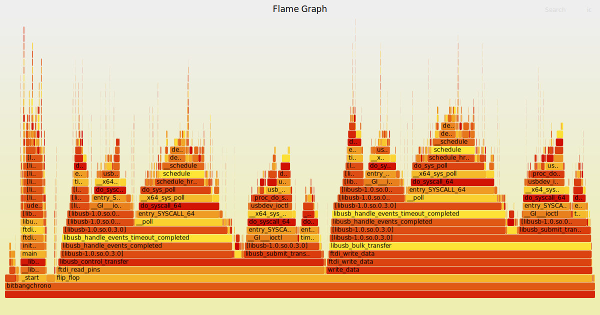
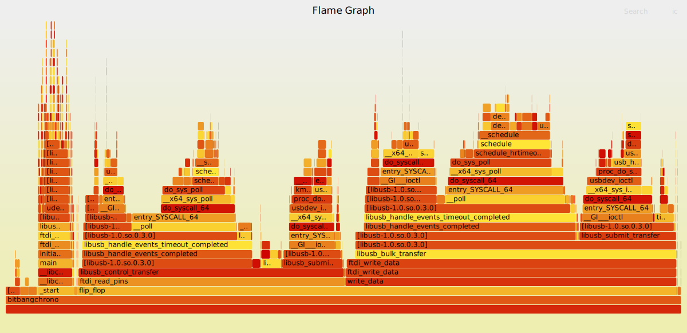
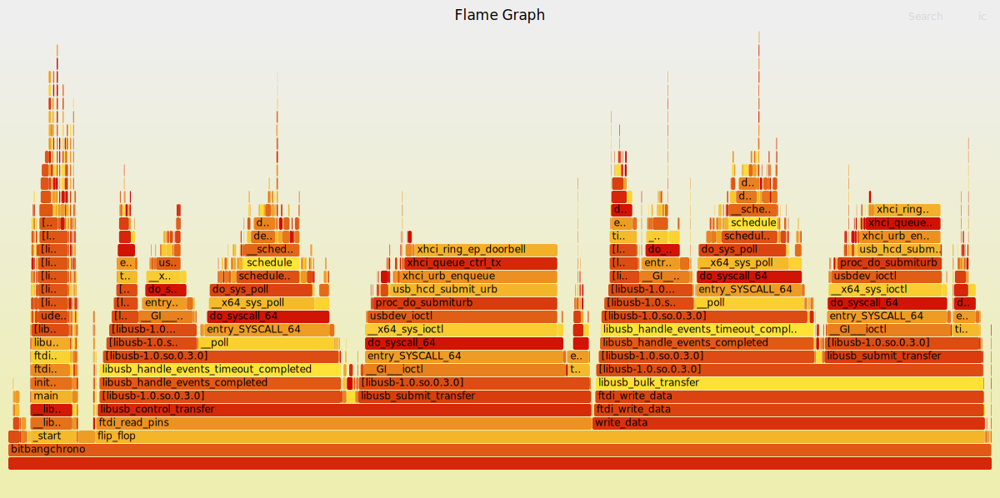

# BitBangChrono

## Overview
BitBangChrono measures time of different operations on an FTDI device in bitbang mode and a loopback connection.

As an example, I found consireable latency differences between different USB ports on my testing notebook. I was not surprised by the differences between USB-2 and USB-3, but by the difference between two USB-2 ports:

### right port, USB-2:
```bash
$ sudo nice -19 ./bitbangchrono -f 131072
131072 flipflops, time 67413ms
kbps: 1.944
rtt min/avg/max/mdev = 436/514/2793/2357 us
```

### back port, USB-2:
```bash
$ sudo nice -19 ./bitbangchrono -f 131072
131072 flipflops, time 33798ms
kbps: 3.878
rtt min/avg/max/mdev = 225/257/1393/1168 us
```

 ### left port, USB-3:
```bash
$ sudo nice -19 ./bitbangchrono -f 131072
131072 flipflops, time 16865ms
kbps: 7.772
rtt min/avg/max/mdev = 91/128/1127/1036 us
```

### right port, USB-2 (~67 seconds):


### back port, USB-2 (~34 seconds):


### left port, USB-3 (~17 seconds):


## Requirements
- An FTD232 device with two of it's ports connected to each other
- Linux
- User access to the usb subsystem (I added the following udev rule: `SUBSYSTEM=="usb", MODE="0664", GROUP="plugdev"` and added my user to the `plugdev` group)
- FTDI C libraries
- GCC

## Installation

### Clone the Repository
```bash
git clone https://github.com/petersenna/bitbangchrono.git
cd bitbangchrono
```

### Call make
```bash
make
```